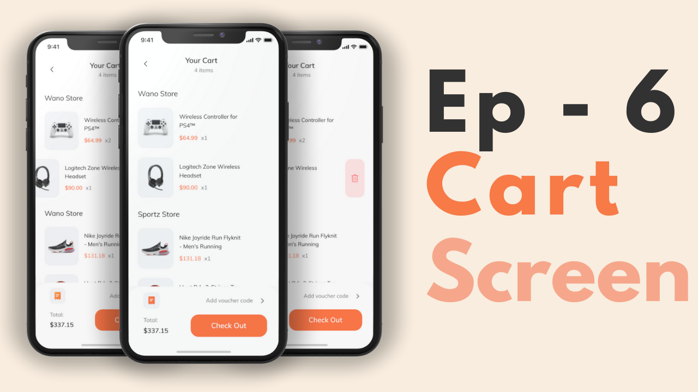

<<<<<<< HEAD
# E-Commerce Complete Application ->
=======
# E-Commerce Complete App - Flutter UI 
>>>>>>> 174b5b3b1cb52bc82c1d1b0ff62cc3b423fe41fa

A complete ecommerce application with dual backend 😎 Node.js(Backend with TS) and Firebase backend. The frontend is built with Flutter and [provider + get] state mangement is their.

**Design Credits**
Flutter Way {YT} - [E-Commerce Complete App - Flutter UI](https://github.com/abuanwar072/E-commerce-Complete-Flutter-UI) --  Give the author a :star2: ！  

**Packages we are using:**

- [] flutter_svg: [link](https://pub.dev/packages/flutter_svg)
- [] google_fonts: 
- [] cupertino_icons:
- [] provider:
- [] uuid:
- [] get:
- [] shared_preferences:
- [] cloud_firestore: ^3.1.10
- [] cupertino_icons: ^1.0.2
- [] firebase_auth: ^3.3.13
- [] firebase_core: ^1.14.0
- [] firebase_storage: ^10.2.11

### Video Preview of Final UI
<<<<<<< HEAD

=======

>>>>>>> 174b5b3b1cb52bc82c1d1b0ff62cc3b423fe41fa

## Screens it contains:
- [x] Onboarding
- [x] Login
- [x] Forgot Password
- [x] Sign Up
- [x] Complete Profile
- [x] OTP Verification
- [x] Home Page
- [x] Product Details
- [x] Order
- [x] Profile (added)
- [x] Bottom Navigation Bar (added)

## instructions

This is achieved step by step according to the homework, if you are interested you can go directly to the source code.  

## Photos
<<<<<<< HEAD

Now it contains all the screen, thanks for your love and support 🙏 
=======

>>>>>>> 174b5b3b1cb52bc82c1d1b0ff62cc3b423fe41fa
